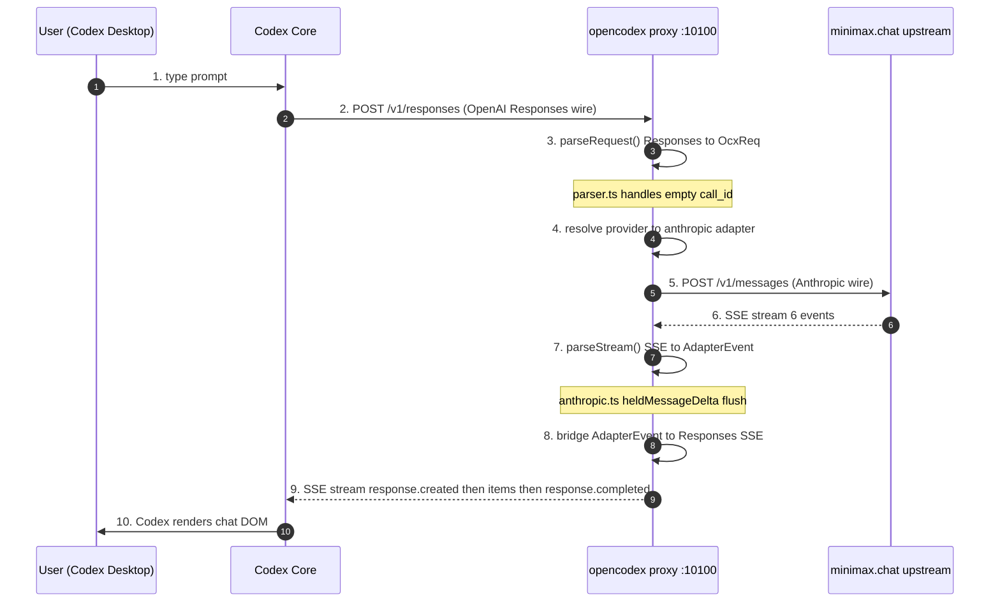
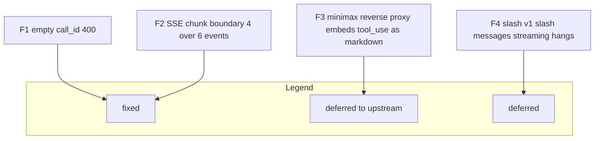

# opencodex data flow

Last verified: 2026-08-31 against ~/.codex/config.toml on the user machine.
wire_api = responses, base_url = http://localhost:10100/v1.

## End-to-end request flow (mermaid)

## Failure points (known + observed)

## Configuration that picks this path

From ~/.codex/config.toml verbatim on 2026-08-31:

    model_provider = custom
    model = minimax.chat slash MiniMax-M3
    wire_api = responses
    base_url = http://localhost:10100 slash v1

Key fact: wire_api = responses, NOT chat, NOT anthropic_messages.
Codex posts OpenAI Responses shape to opencodex. opencodex then rewraps to
Anthropic messages upstream. So the only wire format Codex sees on the
wirein side is OpenAI Responses; the Anthropic messages wire is hidden
behind opencodex.

## Where exceptions live

parseRequest failure returns 400 with JSON error body in Anthropic shape.
parseStream midstream failure closes the SSE response; Codex sees an
incomplete stream and surfaces an error to the user.

## What this document is NOT

Not a protocol spec. For Anthropic SSE event ordering, see AGENTS.md.
Not a deployment diagram. Single host, all local.
Not a benchmark. Step latency not profiled here.
